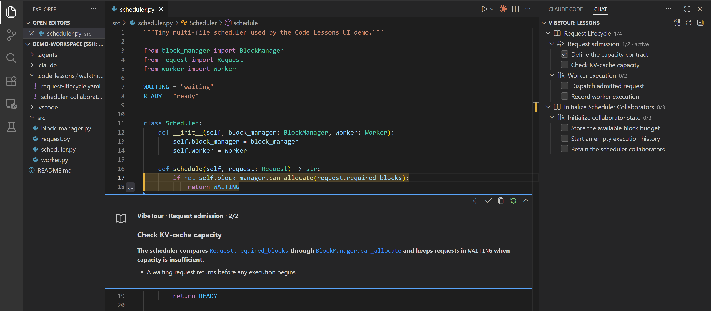

<h1 align="center">📖 VibeTour</h1>

<p align="center">
  <strong>Let coding agents turn a codebase—or the changes they just made—into a guided walkthrough.</strong>
</p>

<p align="center">
  
  
  
</p>

<p align="center">
  <a href="#install">Install</a> ·
  <a href="#quick-start">Quick start</a> ·
  <a href="#let-your-coding-agent-author-the-lesson">Coding agent skill</a> ·
  <a href="#lesson-format">Lesson format</a>
</p>

<p align="center">
  
</p>

<p align="center">
  <sub>✨ After your coding agent creates the lesson, press Play to follow its explanation through the real source.</sub>
</p>

VibeTour lets Codex, Claude Code, and other skill-compatible coding agents explain code as an interactive walkthrough inside VS Code. Ask an agent to teach you an unfamiliar subsystem, trace an execution path, or explain the work it just completed. The agent uses the current checkout and conversation to select focused source ranges, connect related files, and validate the lesson before VibeTour presents it.

> 💡 **Just ask for an explanation in natural language. You do not have to write lesson YAML by hand.**

## 🎯 Motivation

Large codebases are difficult to understand one file at a time. Important behavior is often spread across entry points, interfaces, state owners, and cleanup paths, leaving developers to reconstruct the real execution flow from searches and scattered references.

Coding agents make changes quickly, but reviewing those changes can be just as challenging. A diff shows what changed; it rarely explains how the pieces work together, why each location matters, or which surrounding code deserves attention. VibeTour lets the agent turn the context it used while working into a focused, source-grounded walkthrough—so you can review a recent change or learn an unfamiliar subsystem one meaningful step at a time.

## ✨ From agent work to guided lesson

| 💬 1. Ask your coding agent | 🧠 2. The agent builds the lesson | ▶️ 3. Learn inside VS Code |
| --- | --- | --- |
| “Explain the changes you just made” or “Teach me how request scheduling works.” | The bundled skill inspects the code, diff, and recent conversation, then writes and validates a focused lesson. | VibeTour opens each real source range, shows the explanation beside it, and links related code across files. |

## 🌟 Highlights

- Generate lessons from the current codebase or the changes your agent just made.
- Preserve the agent's explanation as version-controlled `.code-lessons` files.
- Discover `.code-lessons` owned by nested repositories in a multi-repo workspace.
- Organize learning paths into lessons, chapters, and focused steps.
- Start, resume, reset, and track progress per chapter.
- Keep multi-line Markdown explanations expanded beside the relevant code.
- Link concepts in an explanation directly to related locations across files.
- Highlight the current, upcoming, completed, and related code ranges.
- Copy the current Step as YAML, ready to paste into Codex or Claude with a question.
- Validate lesson structure, paths, IDs, and line ranges and report errors in Problems.
- Reload lessons automatically when their YAML changes.
- Work with local, SSH, WSL, Dev Container, and Codespaces workspaces.

## ✅ Requirements

- VS Code 1.85 or newer.
- Codex, Claude Code, or another compatible coding agent is recommended for lesson generation.

<a id="install"></a>

## 📦 Install

Download the latest `vibe-tour-<version>.vsix` from [GitHub Releases](https://github.com/serendipity-zk/VibeTour/releases/latest).

Install it from a terminal:

```bash
code --install-extension vibe-tour-<version>.vsix
```

Or open the VS Code Command Palette and run **Extensions: Install from VSIX...**. On Windows, do not double-click the VSIX: that may open the Visual Studio installer instead of VS Code.

### 🌐 Remote Development

VibeTour runs as a workspace extension so it can read the project containing the lesson. For Remote SSH, WSL, Dev Containers, or Codespaces, install the VSIX from a VS Code window that is already connected to the remote workspace.

If the file picker shows the remote filesystem, first copy the VSIX to the remote machine and select it there. For example, from a local PowerShell session:

```powershell
scp "$env:USERPROFILE\Downloads\vibe-tour-<version>.vsix" `
  my-server:/tmp/vibe-tour-<version>.vsix
```

Then run **Extensions: Install from VSIX...** in the connected window and select the file under `/tmp`.

<a id="quick-start"></a>

## 🚀 Quick start

1. Install VibeTour and open the project you want explained.
2. Select the **VibeTour** book icon, then choose **Install or Update Authoring Skill**.
3. Ask your coding agent to create a lesson:

   ```text
   Use $generate-code-lesson to explain the changes you just made.
   ```

   Or ask for a focused codebase tour:

   ```text
   Use $generate-code-lesson to teach me how request scheduling works.
   ```

4. VibeTour discovers the generated lesson automatically. Expand a Chapter and select **Play**.
5. Move through the real code, follow related links, and mark each Step done.

VibeTour does not modify source files. Progress is stored in VS Code workspace state.

<a id="let-your-coding-agent-author-the-lesson"></a>

## 🤖 Let your coding agent author the lesson

VibeTour includes the `generate-code-lesson` authoring skill for [Codex](https://developers.openai.com/codex/skills/) and [Claude Code](https://code.claude.com/docs/en/slash-commands). It teaches the agent to turn its current task context into a focused lesson: recent changes become a concise temporary walkthrough, while an explicitly requested subsystem or architecture tour can cover a broader path. The skill verifies every file and line range against the checkout before finishing.

### 🖱️ Install from VS Code

When no lesson is loaded, the VibeTour Lessons panel shows an **Install or Update Authoring Skill** button. VibeTour compares the bundled skill with the project-level and user-level Codex and Claude installations; once any of those locations already has the current bundled version, the panel button is hidden. The Command Palette entry remains available for installing the skill into another agent or scope. The installer lets you:

- select Codex / `.agents`-compatible agents, Claude Code, or both;
- install into the current workspace or for the current user;
- choose a workspace folder when the VS Code window contains multiple roots.

User installation means the user account where the VibeTour extension is running. In Remote SSH, WSL, Dev Containers, or Codespaces, that is the remote environment rather than the local computer.

### ⌨️ Install with `npx skills`

[`npx skills`](https://github.com/vercel-labs/skills) is a third-party cross-agent installer maintained by Vercel Labs. `npx` ships with npm and runs the installer without requiring a permanent global CLI installation. The command can inspect this repository, target one or more agents, and install at project or global scope:

```bash
npx skills@latest add serendipity-zk/VibeTour --skill generate-code-lesson
```

For a non-interactive project installation in both Codex and Claude Code:

```bash
npx skills@latest add serendipity-zk/VibeTour \
  --skill generate-code-lesson \
  --agent codex \
  --agent claude-code \
  --yes
```

Project scope is the default. Add `--global` to make it available across projects for the current user. Run the command inside the remote shell when the coding agent itself runs remotely.

### 🔍 Discovery locations

| Agent | Current workspace | Current user |
| --- | --- | --- |
| Codex / `.agents` | `.agents/skills/generate-code-lesson` | `~/.agents/skills/generate-code-lesson` |
| Claude Code | `.claude/skills/generate-code-lesson` | `~/.claude/skills/generate-code-lesson` |

Codex scans `.agents/skills` from its starting directory up to the repository root, reads skill metadata for discovery, and loads the full `SKILL.md` only when selected. At workspace scope, several other compatible coding agents also scan the shared `.agents/skills` convention and can reuse the same copy. Do not assume the Codex user path is global to every agent: user-level locations differ by harness.

Claude Code searches project and parent `.claude/skills` directories up to the repository root, also discovers nested project skills on demand, and watches existing skill directories for changes. It does not use the Codex project directory, so select Claude Code separately. If a newly created top-level directory is not detected, restart the agent.

After Codex makes a change, ask it:

```text
Use $generate-code-lesson to explain the changes you just made.
```

To explain an existing part of the codebase instead:

```text
Use $generate-code-lesson to teach me how authentication flows through this codebase.
```

In Claude Code, use the slash-command form:

```text
/generate-code-lesson Explain the changes you just made.
```

<a id="lesson-format"></a>

## 📝 Lesson format

The coding agent writes this format for VibeTour; users normally do not need to author it manually. It remains plain, reviewable YAML so teams can inspect, edit, and commit an explanation when it should travel with the code.

Each `.code-lessons` directory defines a lesson root: paths are resolved from its parent directory, and line numbers are 1-based and inclusive. A lesson at `services/api/.code-lessons/walkthroughs/auth.yaml` therefore resolves `src/auth.ts` as `services/api/src/auth.ts`. This supports workspaces containing multiple repositories without requiring each repository to be opened as a separate VS Code workspace folder.

```yaml
schema_version: 1

lesson:
  id: request-lifecycle
  title: Request Lifecycle
  description: Follow a request from admission to execution.

  metadata:
    type: walkthrough
    lifecycle: temporary

  chapters:
    - id: request-admission
      title: Request admission

      steps:
        - id: check-capacity
          title: Check capacity

          primary:
            file: src/scheduler.py
            range:
              start_line: 17
              end_line: 18

          explanation: |
            The scheduler asks [the block manager](code-ref:capacity-check)
            whether the request fits before dispatching it.

          key_points:
            - A rejected request remains waiting.

          related:
            - id: capacity-check
              title: Capacity decision
              location:
                file: src/block_manager.py
                range:
                  start_line: 8
                  end_line: 10
```

The complete authoring contract and validator live in [`generate-code-lesson`](.agents/skills/generate-code-lesson/SKILL.md). The [`demo-workspace`](demo-workspace/.code-lessons/walkthroughs/request-lifecycle.yaml) includes both a workspace-level multi-file lesson and a [lesson owned by a nested repository](demo-workspace/repos/checkout-service/.code-lessons/walkthroughs/checkout-flow.yaml).

## 🧭 Navigation and progress

- **Play** starts or resumes a Chapter at its first unfinished Step.
- **Previous** and **Next** move through the active Chapter.
- **Done** completes the current Step and advances automatically.
- **Stop** closes the current comment and highlights while keeping Chapter progress.
- **Reset** clears only that Chapter and leaves it stopped until Play is selected again.
- Completing a Chapter removes its comment and active highlights.
- Completed ranges keep normal source text with a subdued background.
- Related-code links open and highlight their target; **Back** returns to the lesson Step.
- **Copy Step YAML** preserves the explanation's `code-ref` links and related locations for an AI question.

## ⚙️ Configuration

| Setting | Default | Description |
| --- | --- | --- |
| `codeLessons.searchPaths` | `["**/.code-lessons/**/*.yaml", "**/.code-lessons/**/*.yml"]` | Glob patterns searched in each workspace folder, including nested repository roots. |
| `codeLessons.autoReload` | `true` | Reload lessons when matching YAML files are created, changed, or deleted. |

Use the refresh icon in the VibeTour view to reload manually. Invalid lessons remain out of the tree and appear as diagnostics in the Problems panel.

## 🛠️ Development

```bash
npm install
npm run check
npm test
npm run build
```

Open the repository in VS Code and press F5 to launch an Extension Development Host with the bundled demo workspace. The explicit `vibetour: build` task creates the extension bundle before launch.

Build an installable VSIX with:

```bash
npm run package
```

## 🚢 Releases

The GitHub Actions workflow runs checks and tests, builds the bundle, and uploads a VSIX artifact. A tag matching `v<package.json version>` creates a GitHub Release and attaches the prebuilt VSIX; for example, package version `0.0.3` uses tag `v0.0.3`.

Manual workflow runs build the same downloadable artifact without creating a Release.

## 💬 Support

Report bugs and feature requests in [GitHub Issues](https://github.com/serendipity-zk/VibeTour/issues).
